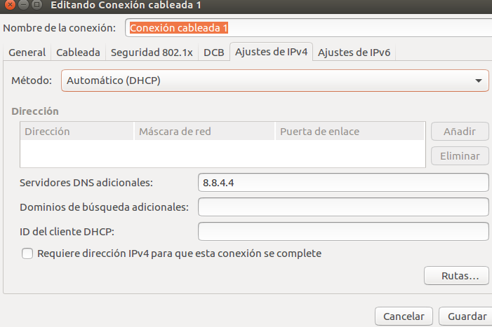

# DHCP EN UBUNTU

     Necesitamos una maquina cliente y servidor de ubuntu en red interna  
#### Paso 1/ Descargamos el dhcp en el servidor  

#### Paso 2/ configuramos el ficher del dhcp
  *  Vamos a "etc/dhcpd/dhcpd.conf"
  y onfiguramos el fichero de la siguiente manera  

    

#### Paso 3/ ponemos el cliente en modo DHCP  
     

  
#### Paso 4/ reinicamos el servidor dhcpd en el servidor  de la siguiente manera:
      /etc/init.d/dhcp3-server restart  

#### Paso 5/  Ahora ya estaria listo  

