# Instalación y Configuración del Servicio FTP en Windows 2012 Server

### 1.- Instalamos la caracteriasttica de serivdor FTP (Es una caracteristica secundaria del IIS)

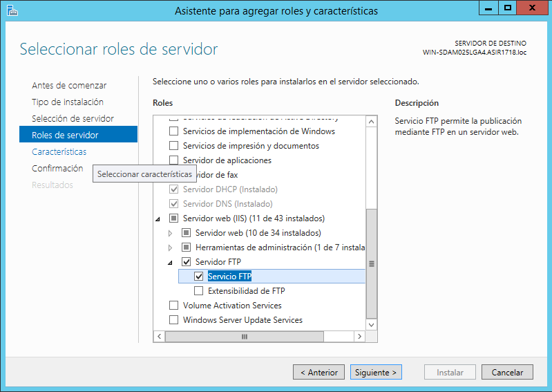
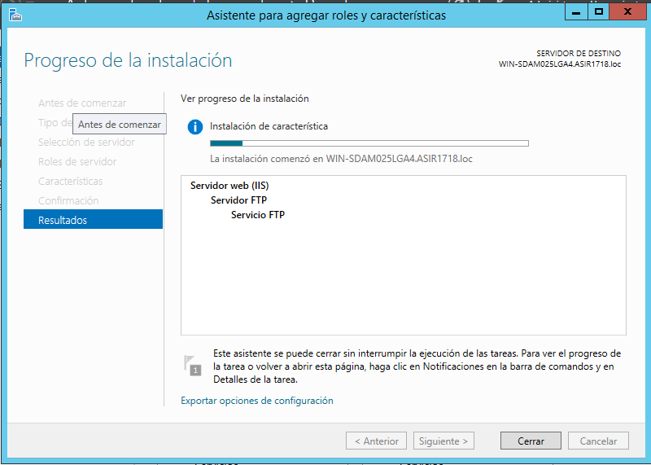

### 2.- hacemos un sitio ftp en el IIS

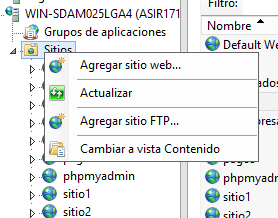

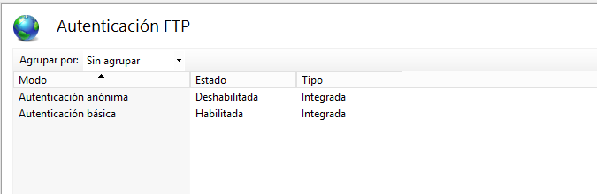

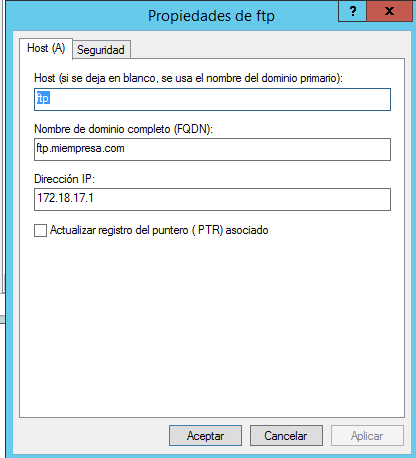

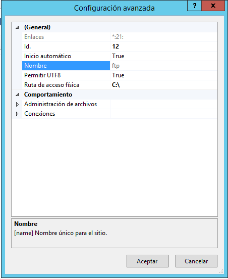

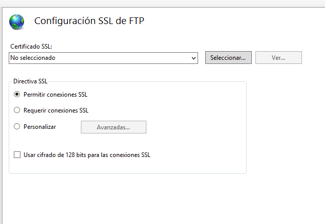
>Al principio el servidor ftp no funcionaba la solucion que hicimos fue ir a enlaces y cambiar la direccion ip por un "*")

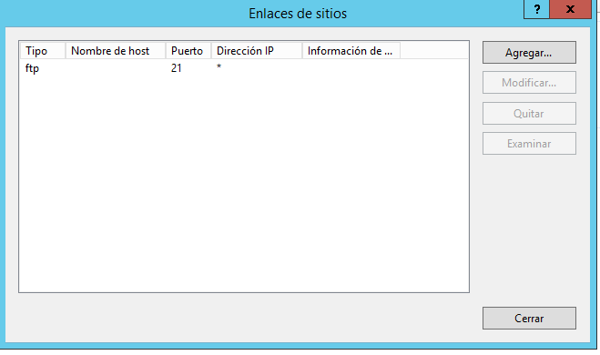

> Y ya nos dejaria entrar

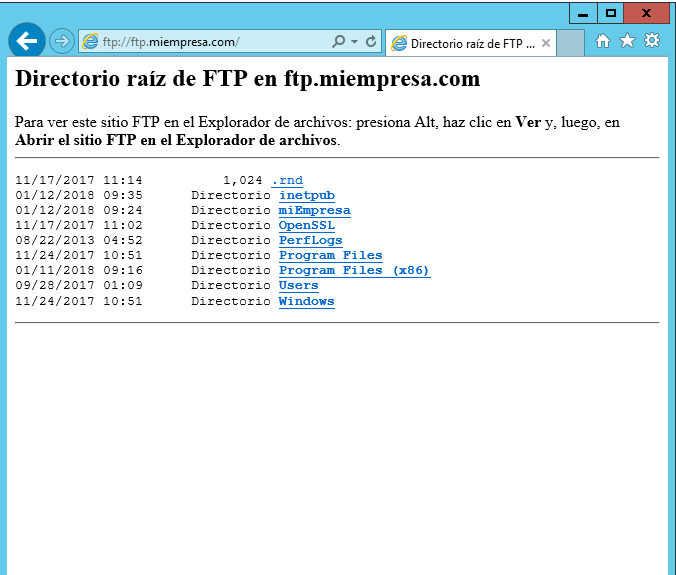

### 3.- Entramos al FTP desde el cliente

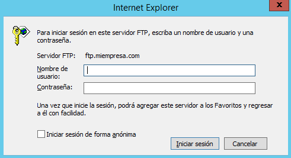

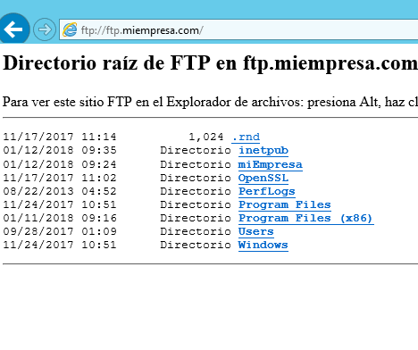

### 4.- creamos usuarios y entramos con ellos

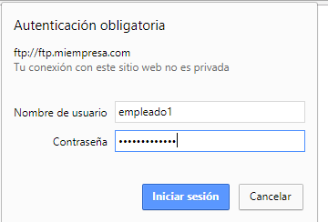

### 4 .- Instalamos WinSCP y hacemos varios sitios ftp

> Vemos que funciona

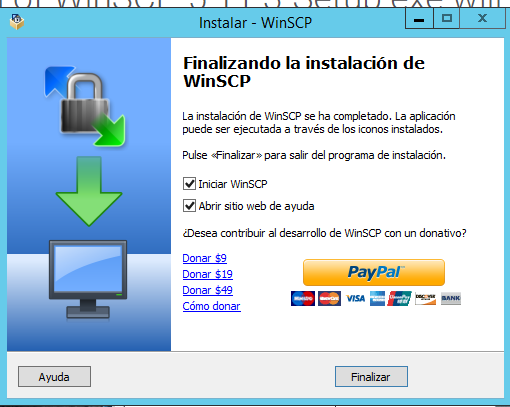

> Creamos los demas usuarios ftp

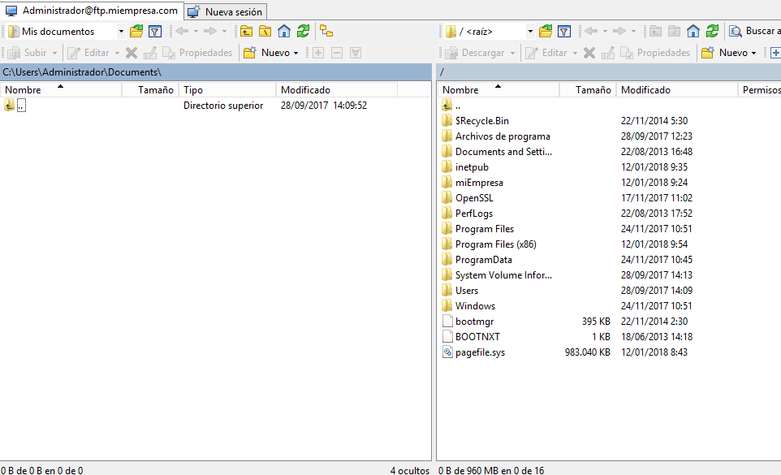

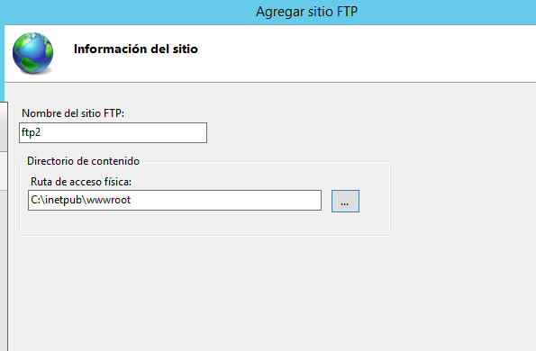

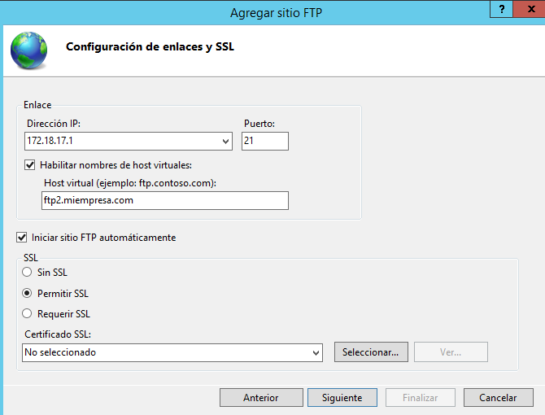

>Y los probamos(este sitio FTP permite SSL)

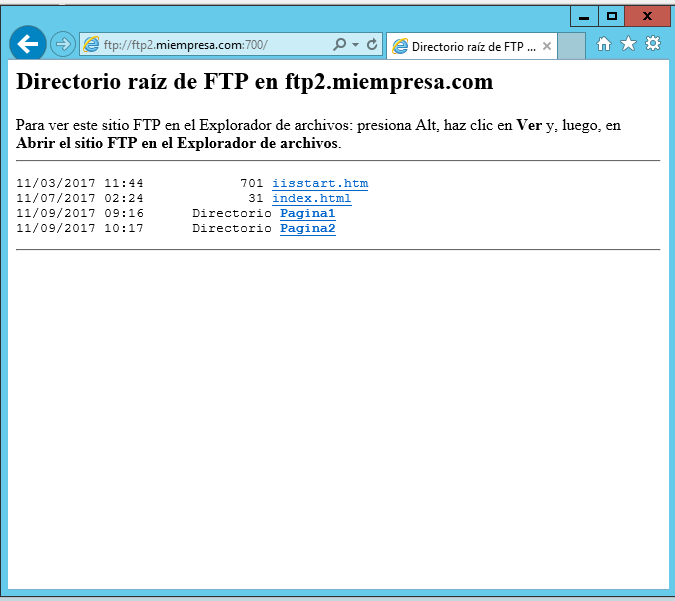

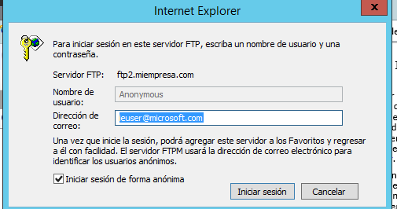

> Podemos entrar permitiendo ssl

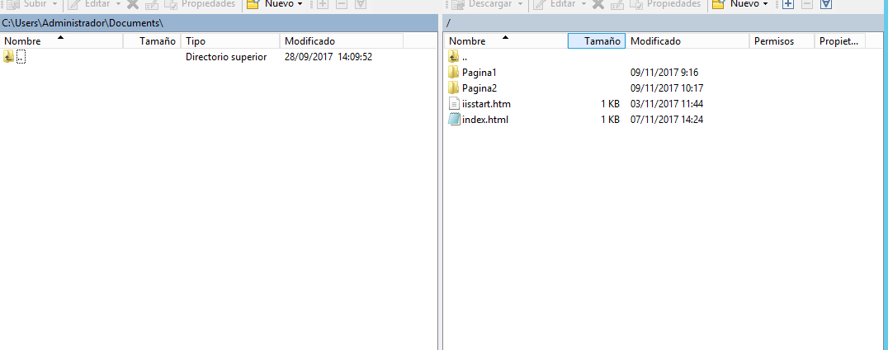

> Creamos el sitio 3

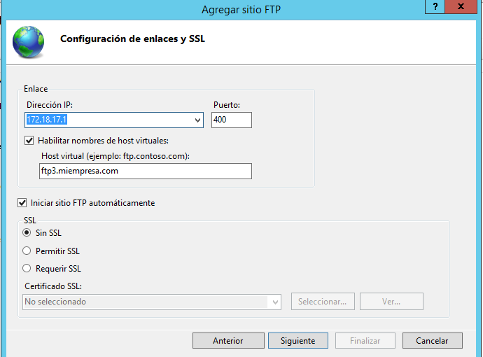

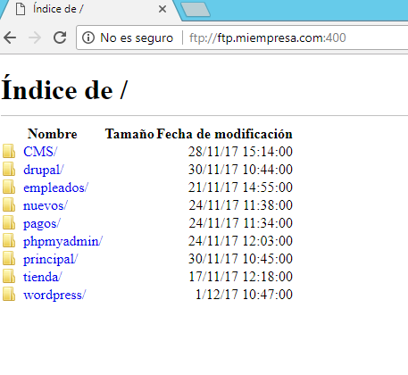

### 5.- ahora buscamos una forma para que se puedan usar los tres sitios a la vez

> para ello le ponemos puertos diferentes a cada uno de los sitios

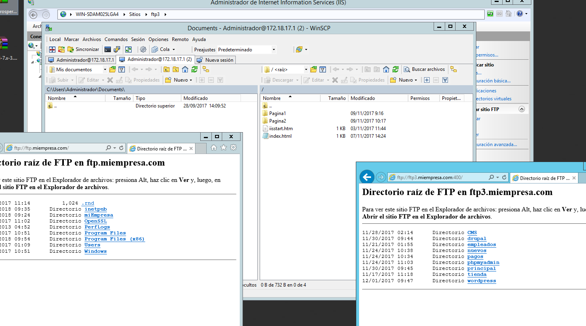

# Instalamos ftp en linux

### 1.-Instalamos ssh y creamos usuarios con ciertos privilegios

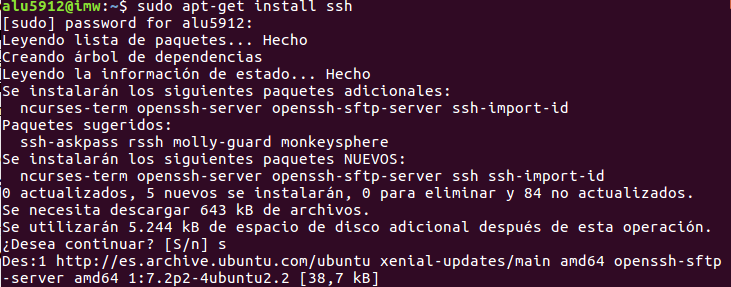

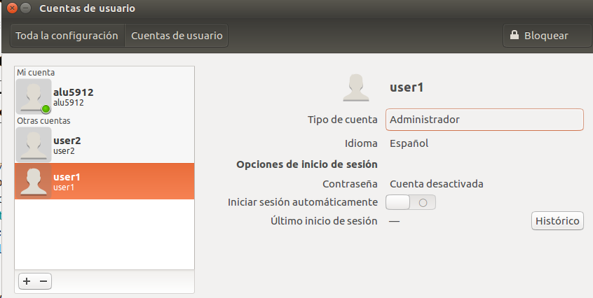

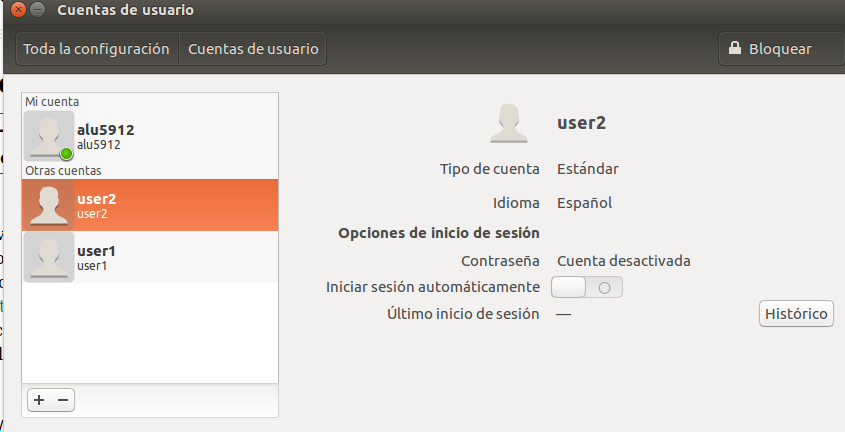

## 2.- accedemos desde un cliente con ssh y ejecutamos una aplicacion grafica

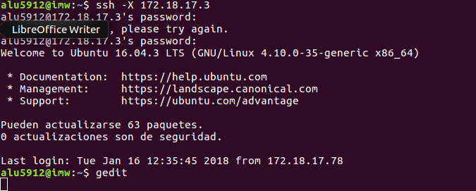

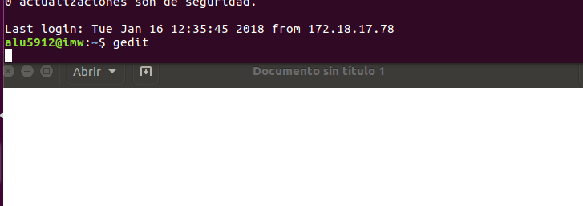

### 2.- Accedemos al servidor usando los usuarios mediante SFTP que se instala con el SSH

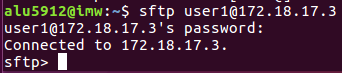

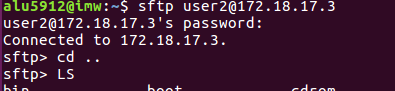

> Y probamos a descargarnos algun archivo

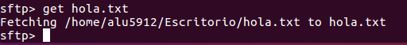

>Subimos un fichero mediante SCP de cliente a servidor

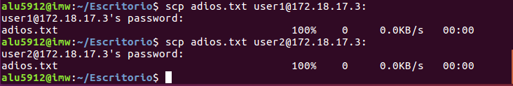

### 3 .- Instalamos proftpd

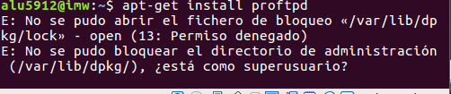

### 4.- Investigamos donde se ediata la configuracion del proftpd

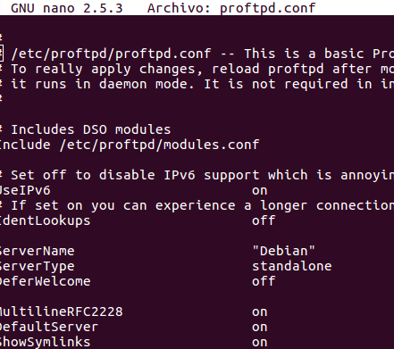

### 5.- Nos conectamos al ftp gestionado por proftpd

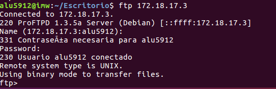

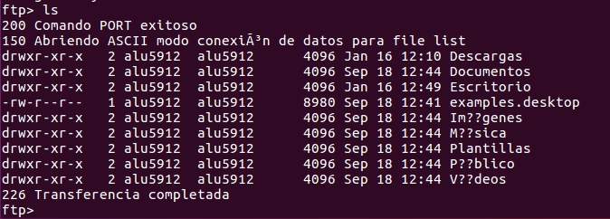

> Y descargamos algo

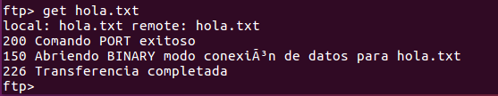
