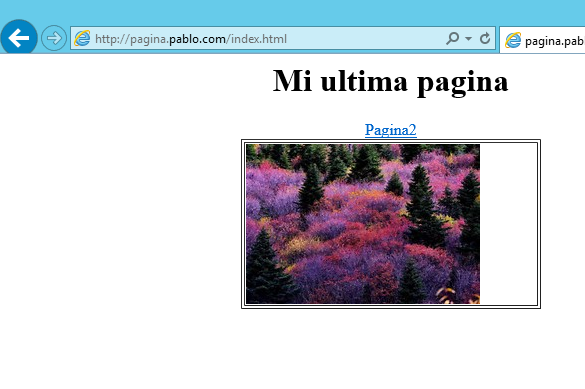

* # Instalacion y configuracion del ISS

## PASO 1 -. Instalación del ISS wn Windows :   

  

   

### Y ya esa instalado :   

    

### PASO 2 -.
**comprobamos el acceso a nuestro servidor web con (localhost)**

**ahora accedemos por el cliente al con la ip del servidor**    

     
   
  **Tambien accedemos al w7 con un alias que hayamos creado en nuestro servidor**  

  

    

  **Ahora accedemos con el dominio principal**    

    

 ### PASO 3 -. creamos una pagina web  

  **Crea  una  página  web  HTML  sencilla  (index.htm)  como  página  principal  de  tu  dominio  y**  
      colócala  en C:\Inetpub\wwwroot.   

        

* # Creacion de sistios web Independientes   

### PASO 1-.   
 **Creamos dos sitios web , uno asociado al dominio principal y otro al subdominio**   

  

### PASO 2-.
 **Definimos algun sitio web con algun tema**    

### Paso 3-.
**hacemos un sitio web que no sea parte del dominio principal , ademas incluir  una  nueva  zona  de  búsqueda  directa  en  tu  servicio  DNS  con  las  opciones  de  configuración necesarias :**   

    

### Paso 4-.  
 **Finalmente,  incorpora  algunos  archivos  HTML,  imágenes  y  subcarpetas  a  tu  nuevo  sitio  web  y  comprueba  el  acceso  desde  navegadores  web  tanto  del  servidor  como  del  cliente  W7**  

      

# Creacion de directorios virtuales

## Paso 1 -.    

**crea  una  carpeta  que  se  corresponda  con una posible sección del sitio web creado en la práctica anterior (creación de sitios web
independientes).  Crea  un  nuevo  directorio  virtual  en  IIS  (dentro  del  citado  sitio  web)  y  relaciónalo con la carpeta que has creado**   

  

  

  

**Comprobar  el  acceso  a  cada  una  de  las  diferentes  secciones  de  nuestro  sitio  web,  tanto  desde el servidor como desde el cliente W7**  
    

      
