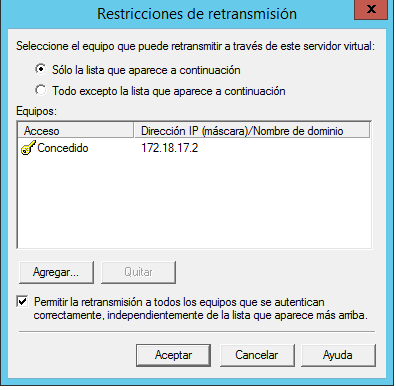
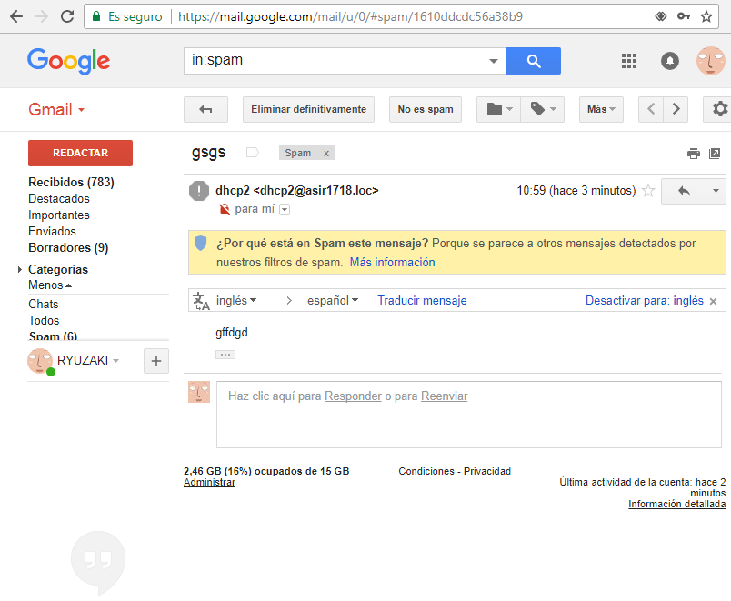
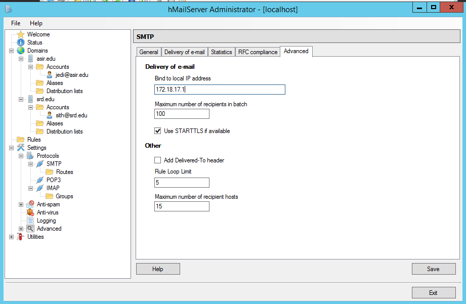

# Práctica Servicio SMTP Windows 2012 Server

## 1.-Instalar Servicio SMTP en Windows 2012 Server

## 2.-Configuración de servicio SMTP a través del administrador de aplicaciones (IIS) 6.0.

## 3.- Deshabilitamos el cortafuegos

## 4.- Descargamos Opera mail

**Lo configuramos de la siguiente manera:**

**Enviamos algo por email a nuestra cuenta personal y vemos que funciona**

>Se guardaran en la carpeta drop en el servidor

## 5.- Hacemos otro cliente de email con usuarios de Active directory ,autentificacion basica y TLS

**En el servidor SMTP ponemos lo siguiente:**

**Luego vamos a las cuentas de active directory y seleccionamos alguna:**

**En el opera mail ponemos a luke(nuestro usuario) en propiedades de la cuenta**

**En propiedades de la cuenta ponemos coneccion seguro TLS**

**Cuando queramos enviar un email nos pedira autentificacion y nos dejara mandar un mensaje:**

# Practica hMailServer

## 1.- En primer lugar, hay que desinstalar el servicio SMTP de Windows 2012 Server

## 2.-Instalamos el servidor hMailServer

## 3.-Creamos los dominios

## 4.-Ejecutamos un diagnostico para ambos dominios

## 5.- Creamos cuentas de usuarios en el hMailServer

## 6.-Realiza todas las opciones de configuración que consideres necesarias y/o convenientes.

## 7.-Enviamos correos de prueba en operamail con los usuarios que Creamos

## 8.-Creamos una lista de distribución y probamos que funciona

>Hacemos el correos

>Vemos que se envian correctamente

