# Instalación y Configuración de un Servidor Web Avanzado (carpetas seguras)

## PASO1-.Crea una nueva zona de búsqueda directa en los servicios DNS asociado al dominio miEmpresa
>  Crea también una carpeta miEmpresa
en C:\ y una subcarpeta ‘principal’.

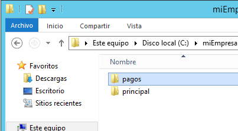

## PASO2-.Crea  un  nuevo  sitio  web  denominado  miEmpresa
>  en  IIS  asociado  a  la  subcarpeta  anterior  y  con  acceso a través de la dirección
www.miEmpresa.com. Actualiza DNS adecuadamente.

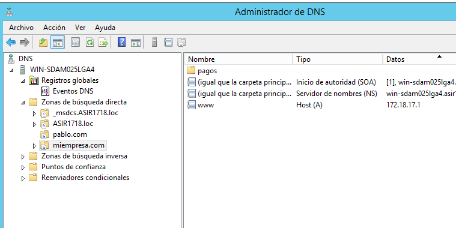

>*Dentro de pagos*  

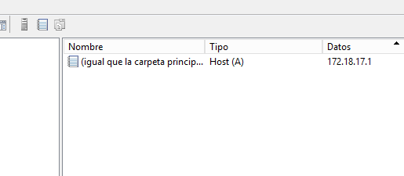
## PASO3-.crea  un  nuevo sitio
>un sitio web (denominado ‘pagos’) como subdominio de miEmpresa, (pagos.miEmpresa.com) y configura
este último para ser accedido de forma segura, vía ‘https’.

* **Vamos al IIS y ceramos el sitio**

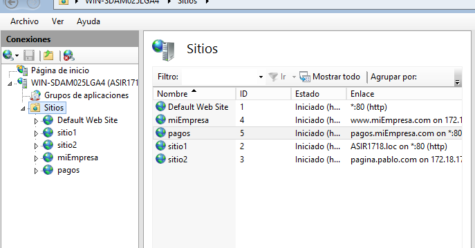

* **Configuración  A: configura  el  nuevo  sitio  para que se pueda acceder (sólo) como sitio web seguro (https) con un Certificado Autofirmado.**  

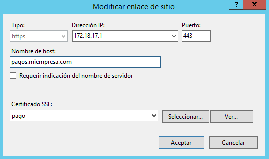  

  

* **Configuración B: Creamos un nuevo sitio seguro (tienda.miempresa.com) con la generación de un  Certificado  Digital a  través  de  la  aplicación  OpenSSL.**

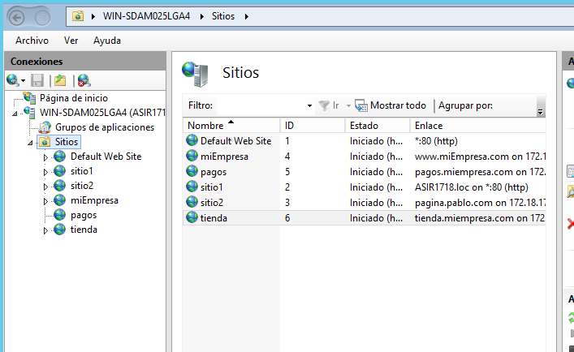  

* **través de OpenSSl genera un nuevo certificado de servidor:**    

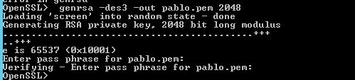   

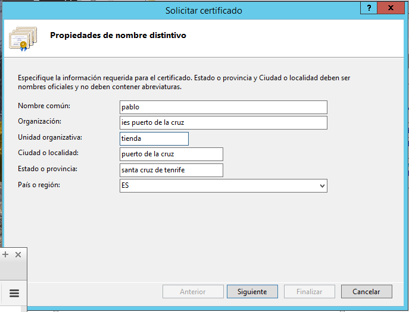  

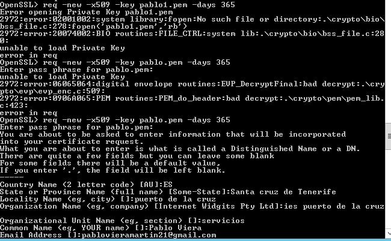  

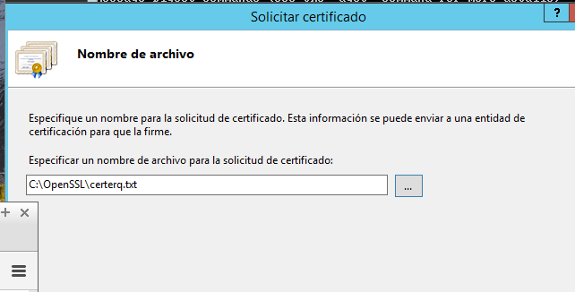  

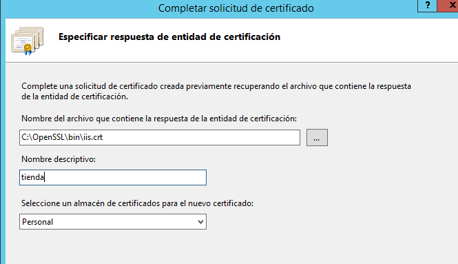    

## PASO4-. Requerir  que  nuestros  sitio  seguros  sólo  se  pueda  acceder  mediante  una  conexión  segura  y  reiniciar los sitios web.    

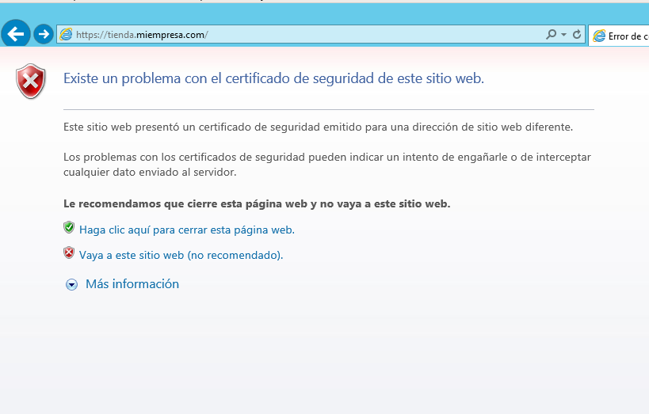    

## PASO5-. Finalmente, acceder mediante http y mediante https a los sitios seguros desde el propio servidor y desde un cliente :
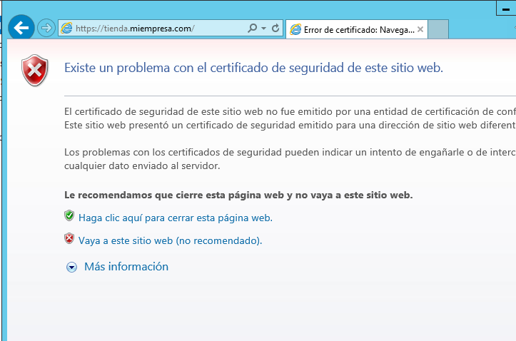    

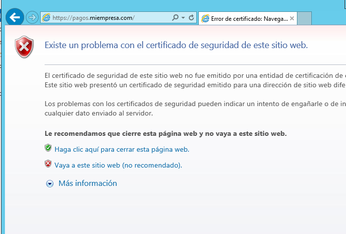  

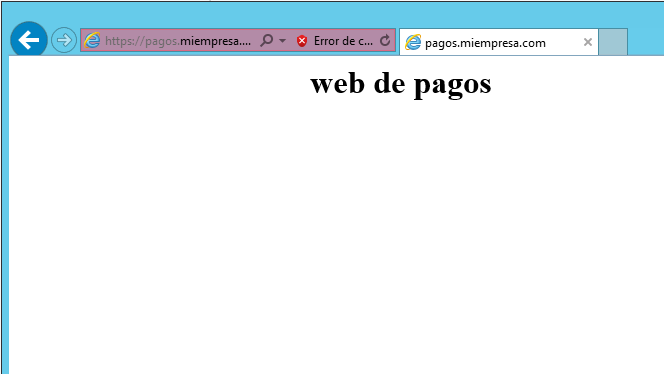     

# Instalación y Configuración de un Servidor Web Avanzado (carpetas privadas)  

## PASO 1-.crear  un  nuevo  sitio  web   
> (empleados.miEmpresa.com) destinado a almacenar información privada de los empleados:  

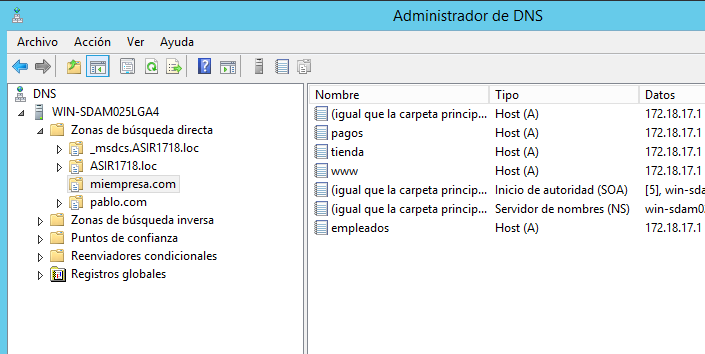  

* **Necesitamos  crear  una  carpeta  empleados  (dentro  de  miEmpresa)  y,  dentro  de  esta,  tres  o  cuatro subcarpetas personales con nombres de empleados**   

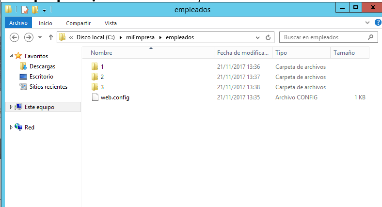  

* **Crearemos  el  nuevo  sitio  web,  como subdominio  de  nuestro  dominio principal,  asociado a  la  carpeta genérica empleados.**  

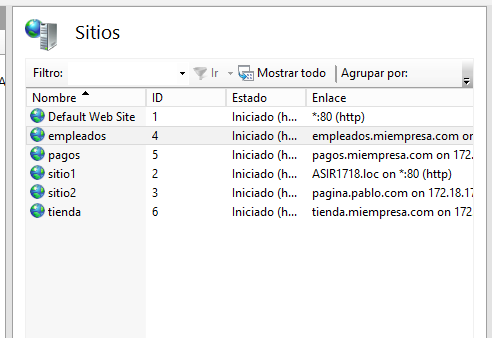    

* **habilitamos la opcion para poder navegar por las carpetas desde la web:**  

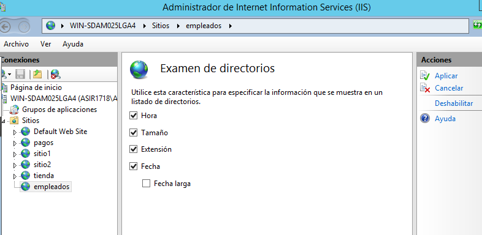   

* **y comprobamos si el sitio funciona:**  

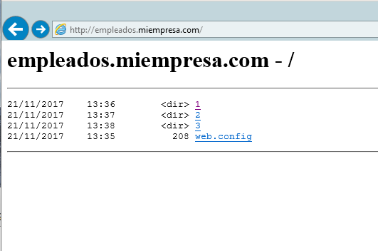   

## PASO 2 -.Quitamos el acceso anonimo a las carpetas y ponemos la funcion de autentificacion basica:  

*  **el sitio principal:**  

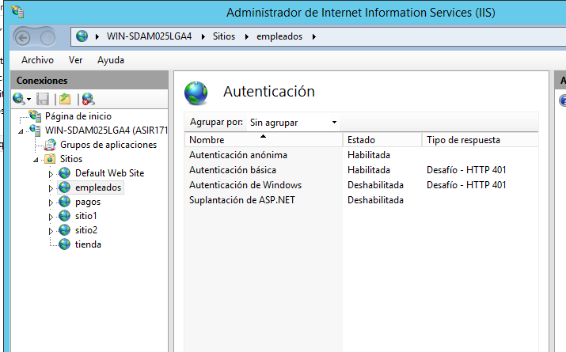  

* **empleado1:**  

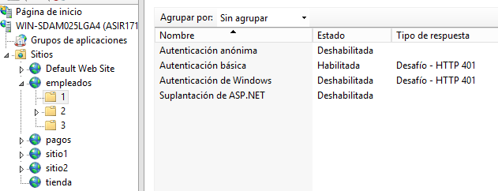    

* **empleado2:**  

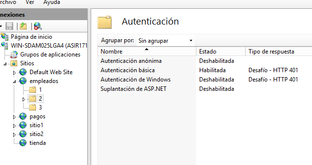  

* **empleado3:**  

   

## PASO 3 -. creamos usuarios empleados y grupo empleados en active directory:  

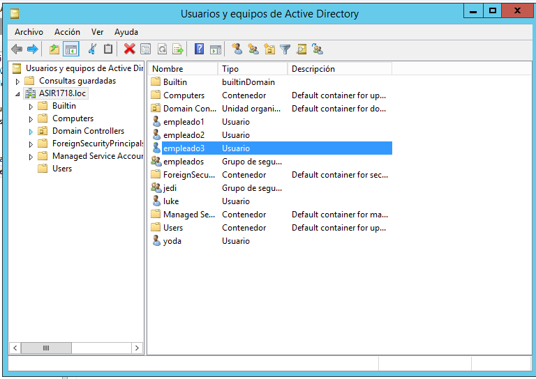   

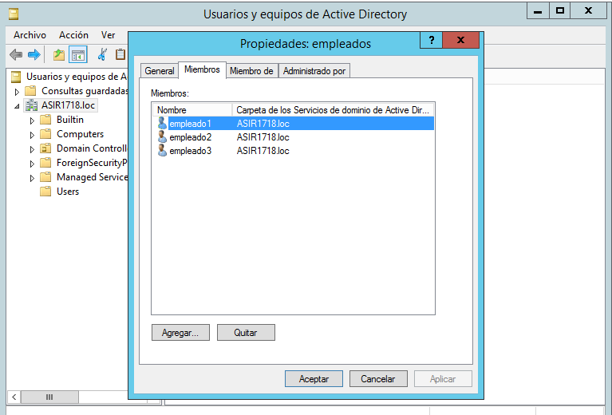

## PASO 4 -. vamos a las carpetas que creamos antes y quitamos permisos a todos los usuarios menos al usuario que hayamos creado para esa carpeta :

* **para la carpeta empleado 1:**    

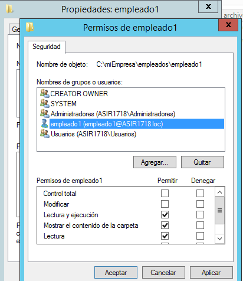   

* **para la carpeta empleado 2:**   

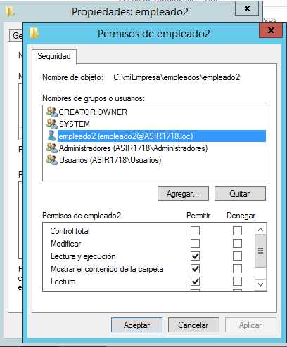  

* **para la carpeta empleado 3:**  

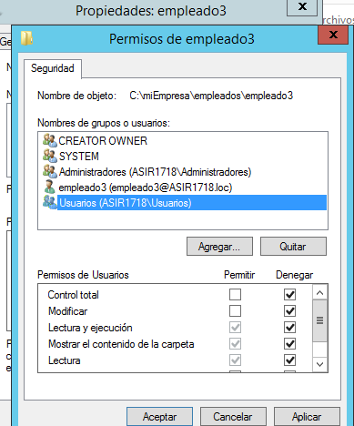     

## PASO 5 - ahora vamos al navegador y buscamos la web   

* **y ya tenemos que poner alguna clave y usuarios para poder entrar**  

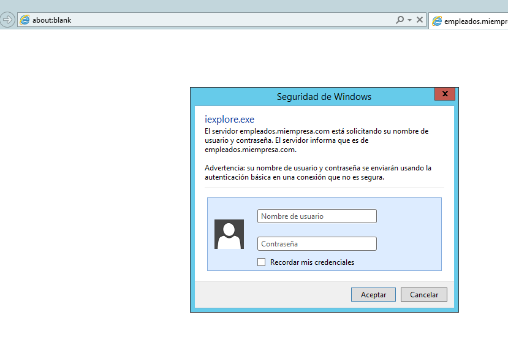
