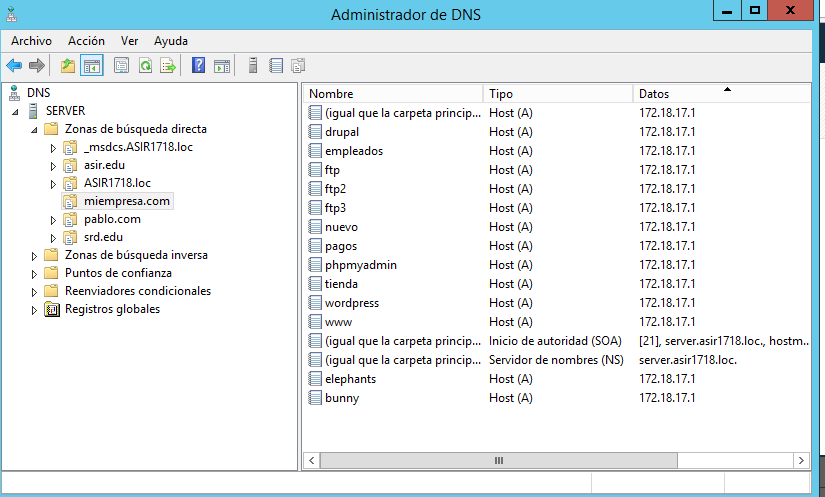
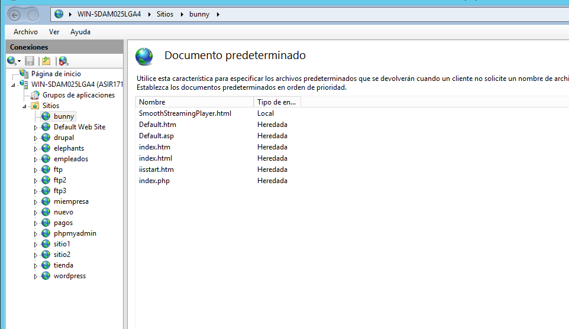
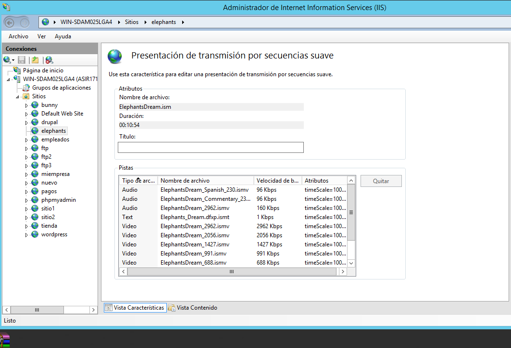

# Instalación y Configuración de un Servidor Multimedia

### 1.- Descargar e instalar IIS Media Services, soporte de Streaming para el Servidor web IIS.

> Creamos dos sitios web asociados a la carpetas

### 2.- Descargar   ejemplos   

de   emisiones   multimedia   codificadas   para   su   emisión   en streaming Windows Media Samples.
> Descomprimir sus contenidos en dos carpetas independientes que nos servirán para su publicación en streaming

> Creamos los dns para cada sitio web

### 3.- Configuramos el fichero SmoothStreamingPlayer.html  para que la url nos apunte a la web
> En el ISS ponemos ese fichero en documento predeterminado

>Ahora vamos a elephants.miempresa y nos saldrá un instalador de silverlight

>Lo instalamos

> Y cuando vamos a elephant.miempresa.com se nos reproducirá

> Y en bunny.miempresa.com tambien

Miramos la limitación de velocidad de bits que sirve para ver la velocidad de transmición de los ficheros

Examinar también la característica de Presentaciones de Transmisión por Secuencia
Suave (Smooth Streaming) para comprobar el punto de acceso a la presentación y sus
contenidos (pistas de audio / video).

# Codificación de contenidos propios

Descargar e instalar Microsoft Expression Encoder y la Característica de Experiencia de Escritorio en tu servidor Windows 2012.

Creamos un nuevo sitio en el IIS llamado playlits.miempresa.com

Descargaos dos archivos y los codificamos en el encoder

