# *Instalación y configuración DNS W2012*

## Paso 1  
 **Creamos una zona de busqueda directa para el servidor y inversa para la subred**   

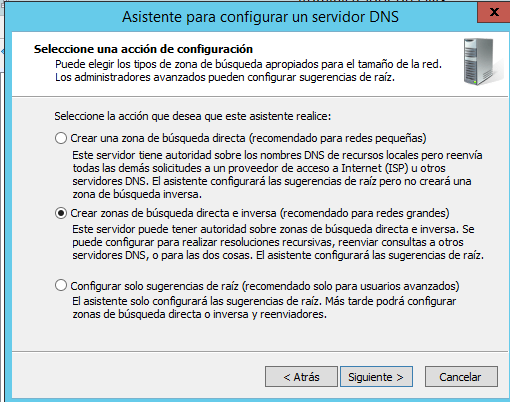  

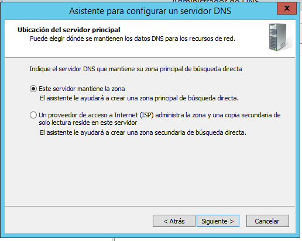  

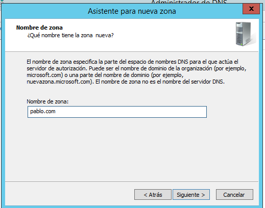  

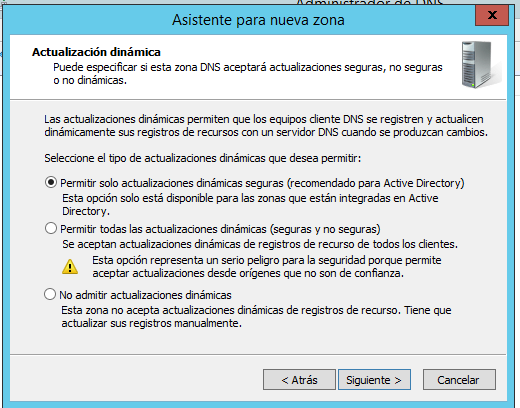  

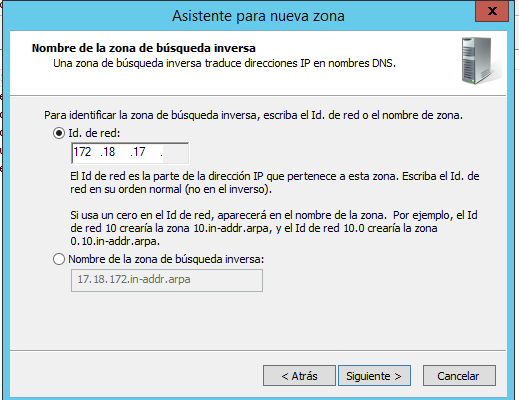    

> Aqui configuramos el reenviador , ponemos por ejemplo la ip de google para que se reenvie a esta ip cuando pongamos la nuestra  

**Y ya estan creadas las dos zonas** :  

   

## Paso 2
**Configuramos la puerta de enlace del cliente**
> Cambiamos la puerta de enlace del cliente por la ip del servidor dns, para que acceda a internet con esta ip que a su vez esta  sera reenviada a la ip de google 8.8.8.8  

**IP del servidor**:  
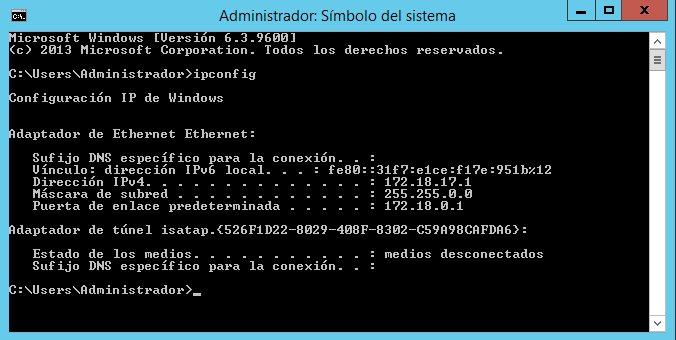

**IP del cliente**:  

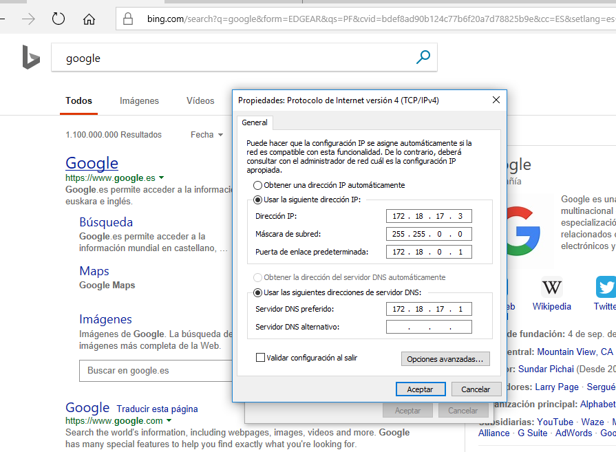   

## Paso 3  
**Ahora configuramos el dns maestro ademas de cache**

**En las zonas de busqueda directa añadimos los siguientes registros:**

+ ***Un alias para tu servidor denominado server***   

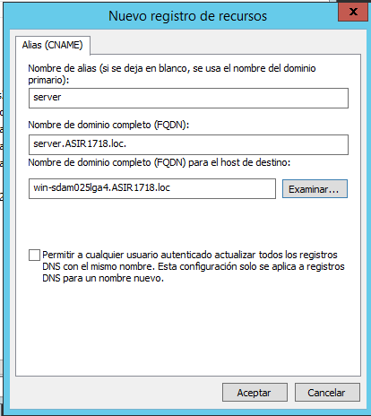  

+ ***Una impresora con IP fija denominada printer (no hace falta alias)***  

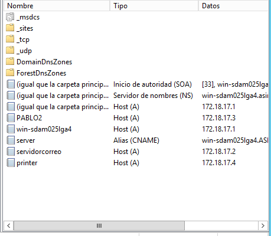   

+ ***Un servidor de correo (ficticio) denominado correo, asociado a una dirección en tu servidor.***

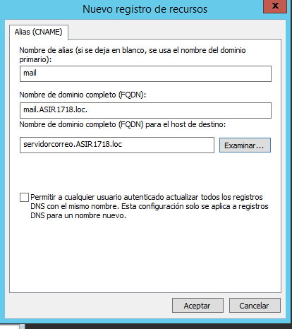  

+ ***una subzona denominada servicio (dominio nuevo) y agregar a ésta un servidor ftp (asociado a la misma IP del servidor), una impresora nueva (con una IP fija) y el equipo del administrador del sistema (también con IP fija).***

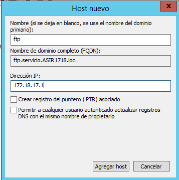    

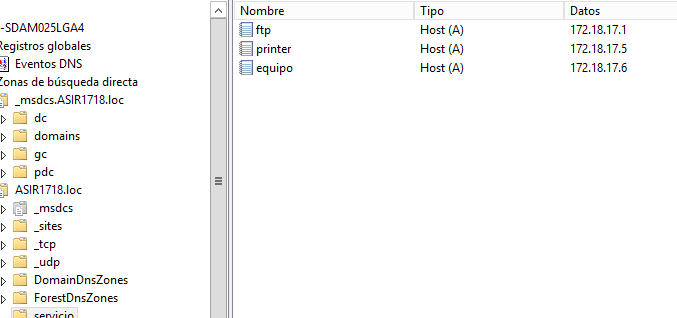

## Paso 4
**Comprobamos que se resuelven los nombres desde la consola del servidor.**

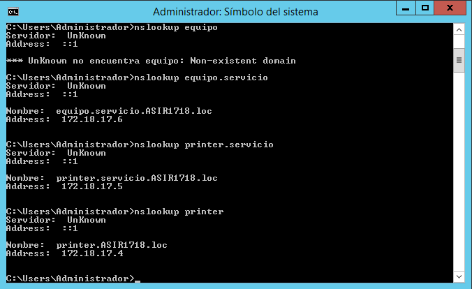   

## Paso 5  

**Metemos al cliente en el dominio del servidor y nos tendra que aparecer en la zona de busqeda como nuevo registro A**  

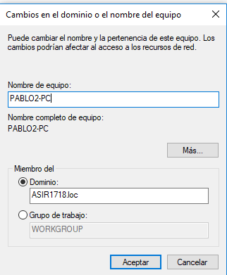  

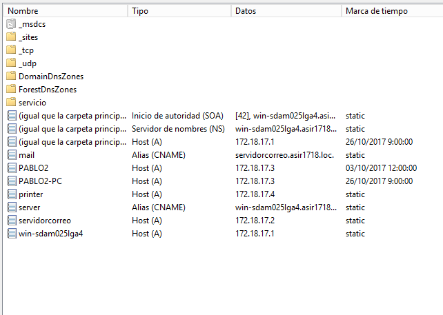   

**Y por ultimo comprobamos si nos funcionan los dns desde el cliente con nslookup**  

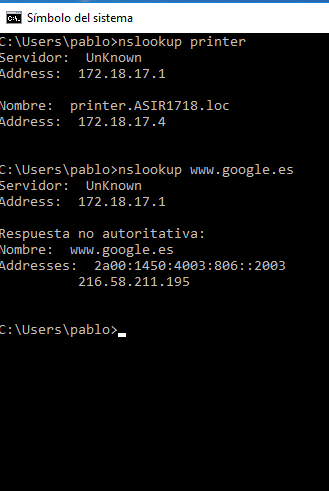
