# Instalación y Configuración de un Servidor de Mensajería Instantánea

### Creamos una base de datos en php
>Ponemos openfire

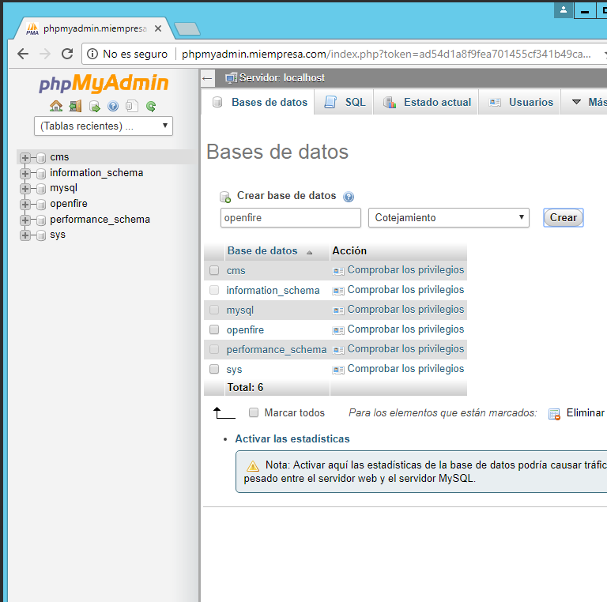

>Usaremos el IIS en esta practica

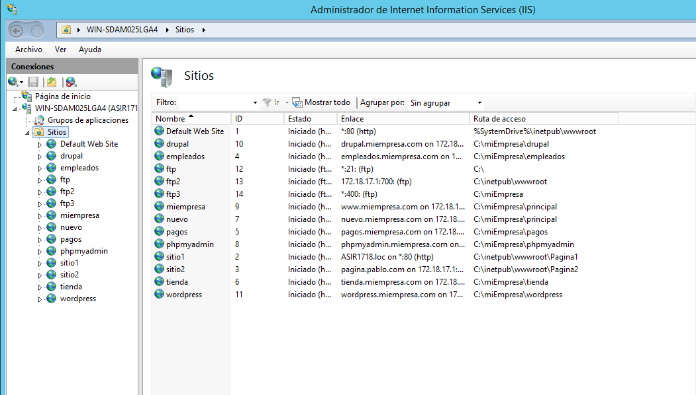

### Descargamos openfire
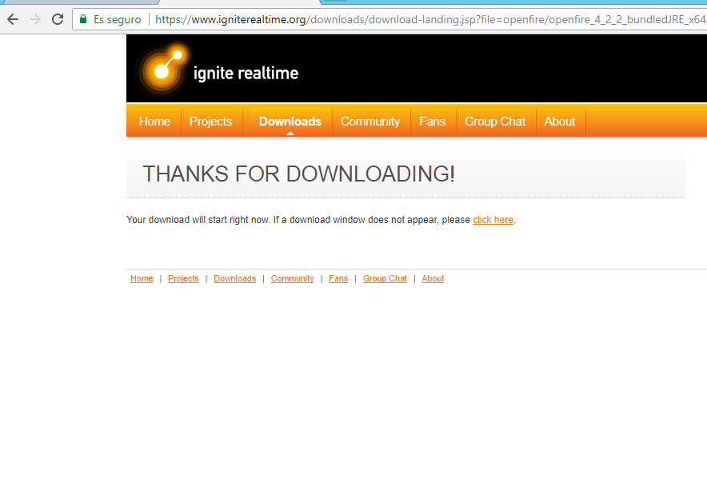
>E instalamos openfire

### Configuramos el openfire

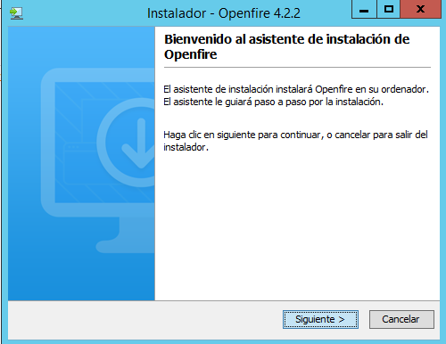

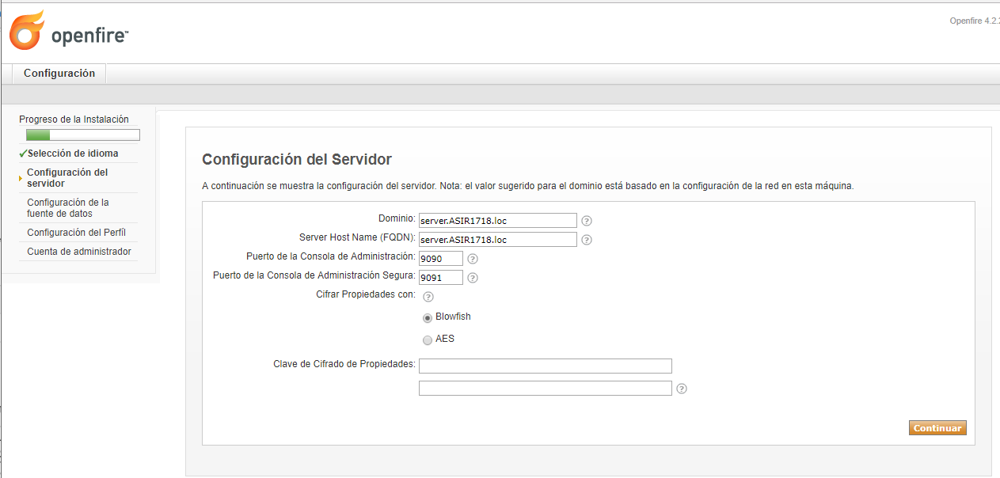

>En la url de la base de datos ponemos:://loclahost:3306/openfire

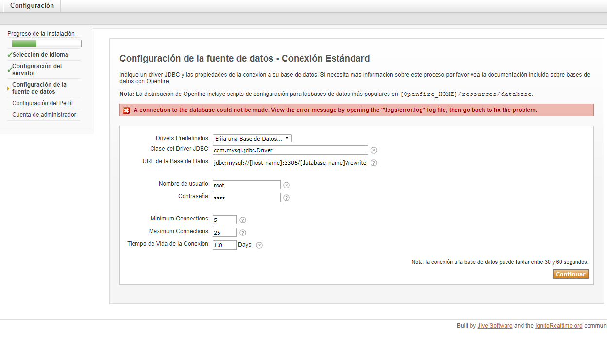

>Creamos cuenta de admin

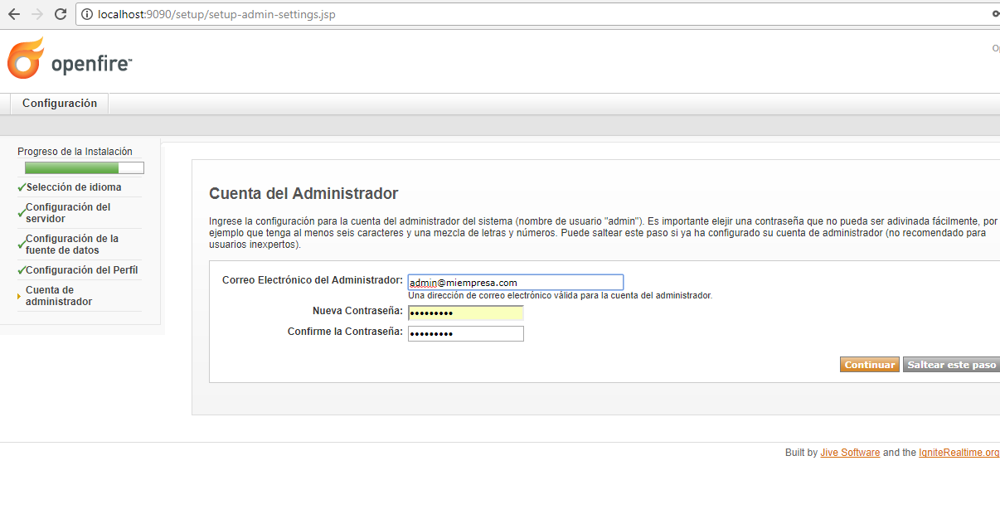

> Y ya estariamos en el panel de configuracion de openfire

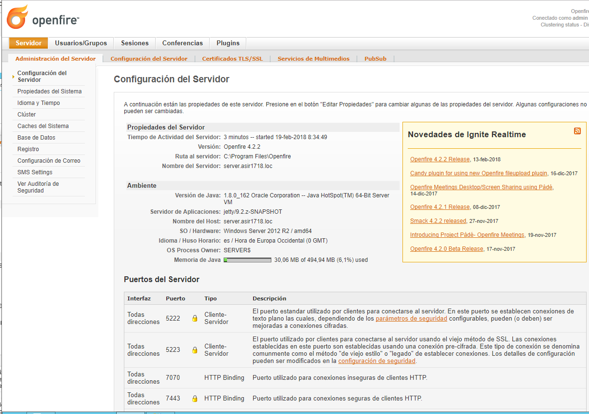

### Descargamos un cliente Sparks
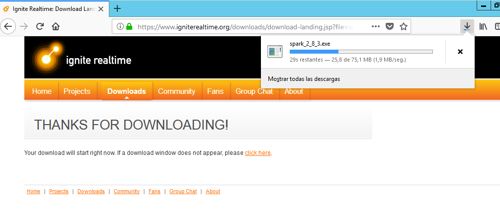

>Lo instalamos

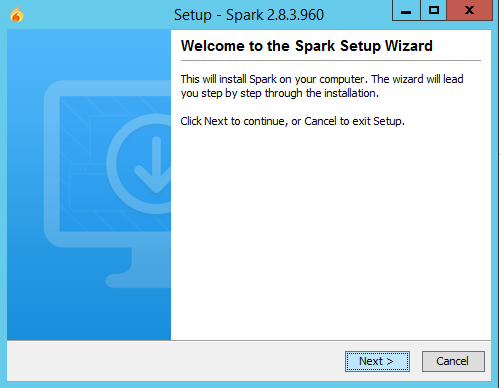

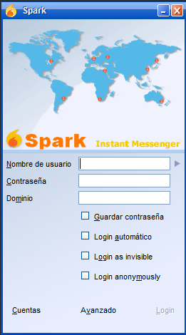

>Marcamos la penultima casilla y la antepenultima

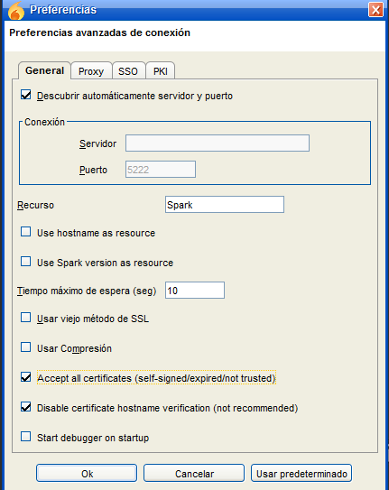

### Creamos usuarios en el openfire

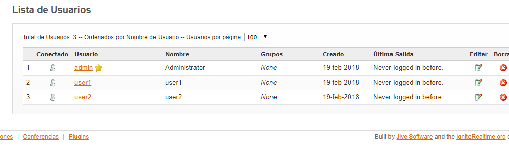

>usamos los usuarios en el Sparks y nos logeamos

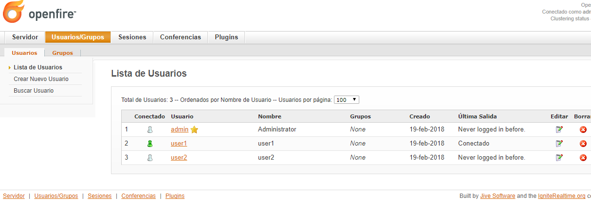
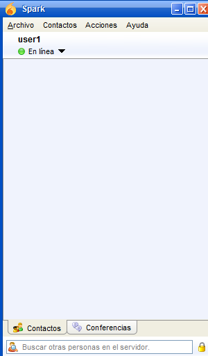

>Agregamos al user2

### Hacemos interacciones entre los usuarios

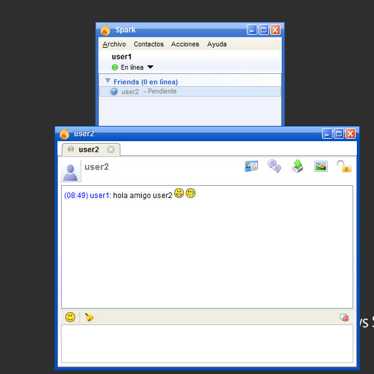

>Entablamos una conversación con los usuarios

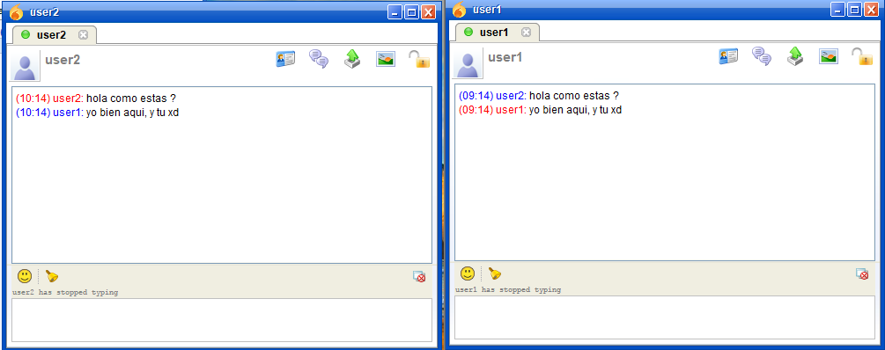

>Probamos a pasar un archivo de texto

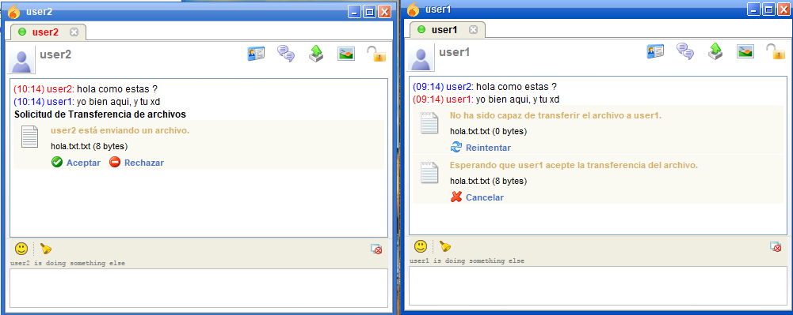

> Hacemos una sala de chat

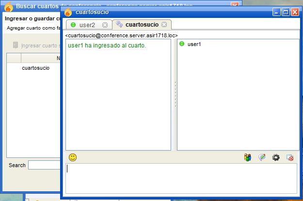
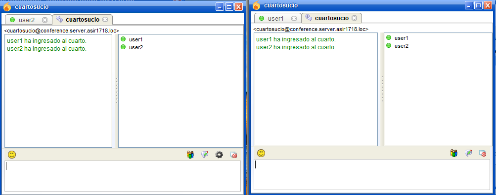

>Hacemos una sala de chat en openfire

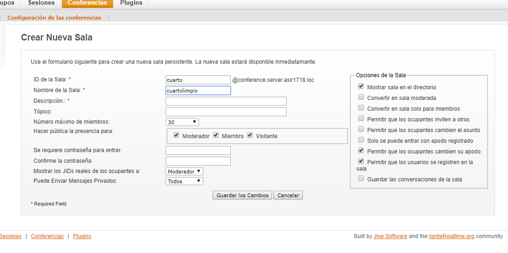

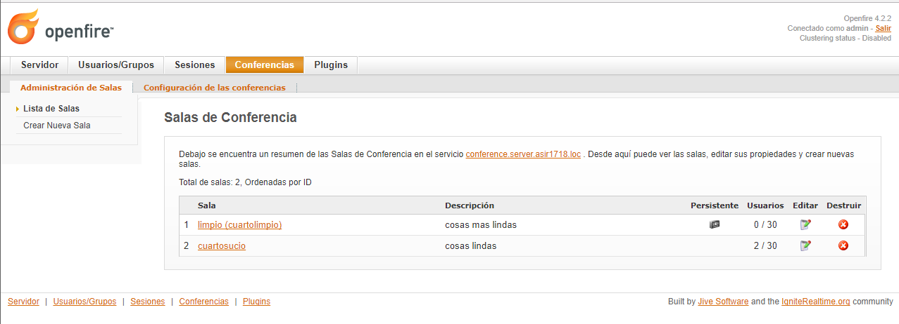

> y entramos en el Sparks

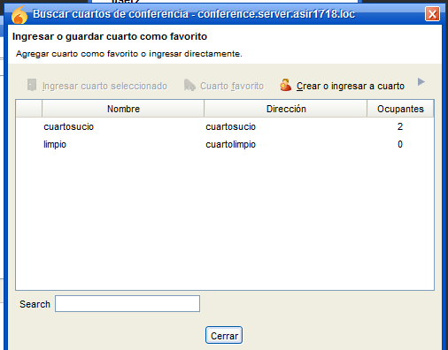

* Pablo Viera Martín
* Yared Martín Perez 
