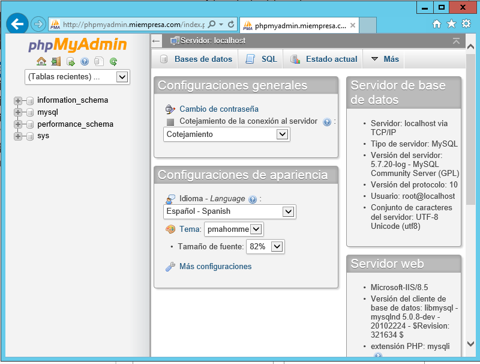
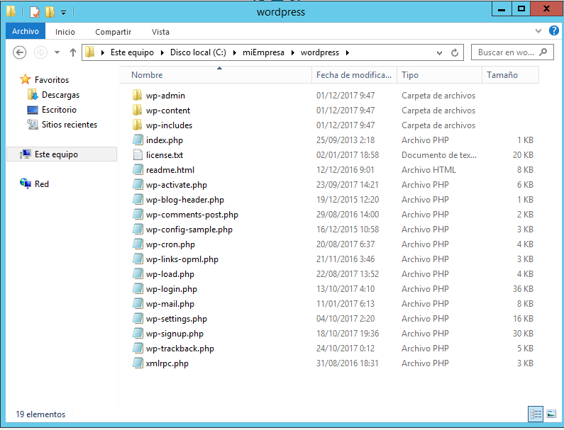

# PHP, MySQL, phpMyadmin, FTP y Drupal

## PASO 1 .-Instalación de PHP, MySQL y PHPMyAdmin  

>Vamos a realizar las instalaciones y configuraciones necesarias para obtener un Servidor Web con
soporte PHP y accesos a bases de datos relacionales, acceso FTP y gestor de bases de datos. Sobre
este servidor, podremos realizar instalaciones de aplicaciones integradas (CMS, e-commerce, etc)
desde el propio servidor o en modo remoto desde un cliente  

* ### Instala soporte para PHP para tus sitios Web gestionados por IIS.   

  

  
* Comprobar la instalación correcta de PHP colocando un fichero index.php en el sitio web destinado
a gestionar el CMS Drupal (www.miEmpresa.com ó miEmpresa\principal)   

   

  
* ponemos el siguiente código en un index.php en la carpeta principal:  
  ><?php phpinfo(); ?>  

  

* ### Instala el servidor de bases de datos relacionales MySQL para tus sitios Web gestionados por IIS      

    

    

   

     

* ### Instala PHPMyAdmin para tus sitios Web gestionados   por   IIS.   Para   esto   debes   crear   un   nuevo   sitio   web   asociado   a phpmyadmin.miEmpresa.com    

     

   
* En la carpeta "phpmyadmin"  puse el contenido de php :    

       

* Luego fuimos a la web y comprobé que se podía acceder a phpmyadmin :  

  

  

## Instalación de Servidor FTP y CMS Drupal    

* Instalar Servidor FTP FileZilla en Windows 2012 Server.  

    

   * Crear un usuario denominado ftpuser en el Servidor FTP y asociarle a este usuario permisos
   de Control Total sobre la carpeta en la que se va a instalar el CMS de miEmpresa.  

  * Crear un nuevo registro DNS que permita acceder a nuestro sitio FTP a través de la dirección
 ftp.miEmpresa.com

  

  

**Ahora se hara todo en modo remoto**:  

* Comprobar acceso a phpMyAdmin desde un navegador (phpmyadmin.miEmpresa.com)

   

* Descargarmos Drupal:  

   

* Comprobar el acceso al sitio FTP creado a través de un navegador y con el usuario ftpuse  

  

* **Instalar un cliente ftp**   

    

* Descomprimir y subir archivos Drupal a carpeta principal  

  

  

* Crear una nueva base de datos, denominada cms, a través de phpMyAdmin  

  

    

  

* **Instalar  CMS  Drupal  desde  el  navegador  siguiendo  los  pasos  y  consultando  documentación  en Internet.**  
> La pagina la cambiamos por *drupal.miempresa.com* por ciertos problemas

  

*  Descargarmos el idioma español y lo metemos una carpeta  dentro del drupal:  

  

   

  

  

  

* Luego Instalamos los temas y los metemos en la carpeta dentro de drupal:  

  

* Y ya tendriamos la pagina del drupal  

* Creamos variass subpaginas    

  

* **Por ultimo instalamos alguna aplicacion a travez del navegador:**    

* Hacemos un dns nuevo con el nombre de la app:    

* Una pagina en IIS:  

  

* Y Creamos una carpeta dentro de miempresa con el nombre del programa a instalar y la descomprimimos ahi cuando la descarguemos:    

* Y por ultimo cuando accedemos a la web ya estaria lista para instalar  

