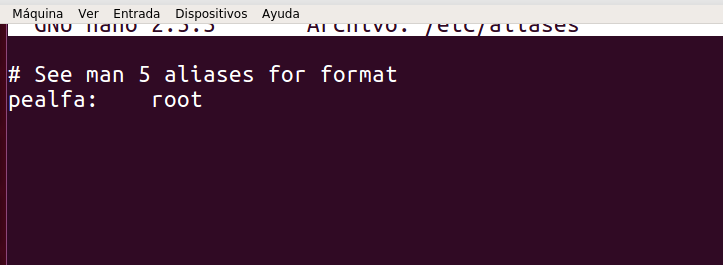

# Instalación y Configuración de un Servidor de Correo

### SMTP

**Instalar servicio SMT en Linux, utilizando el servidor Postfix:**

> creamos el dominio

> netstat –utap

**Realizar  una  prueba  de  envío  de  mensaje  entre  dos  usuarios  del  sistema  mediante telnet**

**Comprobamos que se envio el correo del telnet**

**Editamos el etc/aliases de la siguiente forma**

**Crear  dos  nuevas  entradas  en  /etc/hosts:  smtp.miempresa.com  y  pop.miempresa.com
asociadas a la IP del servido**

**Creamos usuarios en el cliente**

**Instalamos y configuramos Evolution**

> Ponemos IMAP+ y la ip del servidor cuando se solicite

**Y vemos que se ha recibido el correo del evolution correctamente**

>netstat -utap para ver que el IMAP está a la escucha

### IMAP y Squirrelmail

**Descargamos el squirrelmail y comprobamos sus ficheros de configuración**

**Copiar lineas
no comentadas
/etc/squirrelmail/apache.conf
en
un nuevo fichero .conf de
/etc/apache2/sites
-
available
, habilitar sitio
y reiniciar apache**

**Comprobamos desde el servidor y el cliente**

**Probamos desde el cliente a enviar un correo**

**Comprobamos**

### POP3

** Instalamos pop3 y comprobamos puertos**

> En este apartado nos dio error a la hora de configurarlo como a muchos de nuestros compañeros y no pudimos seguir
