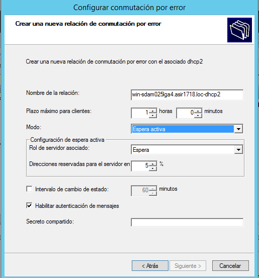

*Alfonso Gonzáles Galván , Yared Martín Pérez , Pablo Viera Martin*

## DCHP FAILOVER  

* ### Paso 1/ Creamos un ámbito en el servidor 1 (DHCP1)

    

  

   

* ### Paso 2/ Clonamos el servidor, reiniciamos la MAC, bajamos un nivel el Active Directory y borramos el ámbito anterior  

     

  * #### Activamos asignacion por DCHP

     

  * ### Paso 3/ Creamos el  FAILOVER  en el DCHP1 asignándole el DHCP2  

  

  

  

   

* ### Paso 4/ Ahora, en el cliente, tenemos que coger la ip del segundo servidor, ya habiendo deshabilitado el primero  

   

